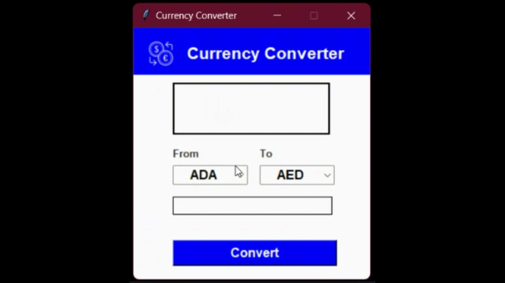

# Currency Converter GUI Application Using Tkinter Python

## How to Set Up Your Virtual Environment

Before you start coding, you'll need to make sure you have all the necessary tools and libraries installed. To ensure that you have a clean and isolated environment, you'll create a virtual environment using `venv`.

Create a project directory and navigate to it in the terminal:

```bash 
mkdir currency-converter
cd currency-converter
```
Create a virtual environment named `env` using the following command:

```bash 
python -m venv env
```
Python now ships with the pre-installed `venv` library to create virtual environments.

Activate the virtual environment like this:

```bash 
source env/bin/activate
```
Note: if you're on Windows, you'll need to use `source env/Scripts/activate` to activate the environment.

You should see `(env)` in your terminal prompt, indicating that the virtual environment has been activated.

How to Install the Libraries
Now that you've created the virtual environment, you can install the following libraries:

`requests`: The library helps you send requests on API endpoints.
`python-decouple`: The library helps you read the values of environment variables.
`pillow`: The library adds image processing capabilities to your Python interpreter.
To install the libraries, run the following command:


```bash 
pip install requests python-decouple pillow
```

### Preview of The Output


To preview the output, just click on the play icon at the top right of this image

## Please give this repo a ⭐ if you found it helpful.

